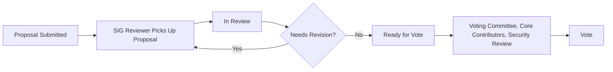

# Development Fund Proposal Review
## Ways of Working

To manage the growing number of Development Fund proposals, the community will use a structured review workflow coordinated through the proposal board:

[https://github.com/orgs/canton-foundation/projects/3/views/1](https://github.com/orgs/canton-foundation/projects/3/views/1)

This process relies on participation from SIG members, Core Contributors, the Security group, and the Voting Committee.

---

# 1. Proposal Assignment

Proposal authors should indicate which **Special Interest Group (SIG)** they believe their proposal best aligns with when submitting their proposal. This helps reviewers quickly identify proposals that match their expertise.

Members of the various SIGs are encouraged to review proposals aligned with their area of interest and may use the proposal tracking board to **self assign proposals they want to review directly.**

Currently, Special Interest Groups are open to any ecosystem participant, including:

- Application developers  
- Node operators  
- Foundation members  

Participation in SIGs is **not limited to Foundation members**. The Technology & Operations committee may review this policy and limit SIG participation if required to meet the goals of the committee. 

When reviewing proposals:

- A proposal moves to 'In Review' once it has been assigned to a champion or reviewer. 
- A proposal may be moved to `Needs Champion` by Core Contributors or members of the Voting Committee if it appears promising but requires additional refinement before it can move forward

Champions help guide the proposal toward clarity, ensuring the **milestones, scope, and acceptance criteria are well defined.**

Anyone in the ecosystem is welcome to provide feedback on proposals. The goal is to collectively improve the quality of submissions and ensure proposals meet the bar expected for Development Fund grants.

---

# 2. Guidance for Reviewing Proposals

When reviewing proposals, consider how they align with the **Q2 priority areas for the ecosystem.**

## Stability and Maintainability

Examples include:

- Operational simplicity  
- Super Validator accountability and monitoring  
- Improvements to maintainability of the codebase  

## Scaling the Network

Examples include:

- Multi-synchronizer architecture  
- Increased BFT throughput  
- Improvements to parties, validators, and network scale  

## App Building and Developer Experience

Examples include:

- Reduced developer friction  
- Interoperability across wallets, assets, and dApps  
- Token standards  
- Wallet gateway and dApp standards  
- Documentation, examples, and training  
- Simplified traffic accounting and application rewards  
- Simpler network upgrades and decentralized parties  
- Lower total cost of ownership (TCO)  

## Security and Resilience

Examples include:

- Security auditing and tooling  
- Hardening against malicious disruption  
- Network resiliency and failover improvements  
- Liveness improvements  
- Monitoring, compliance, and third-party audit capabilities  

---

# 3. Grant Evaluation Expectations

All Development Fund proposals must follow several core principles.

### Public Good

The proposal should create a **shared asset for the Canton ecosystem** rather than primarily benefiting a single organization.

### Sustainability

The proposal must explain **who will operate and maintain the software after the grant period.**

### Adoption-Driven Delivery

Adoption should be the **primary indicator of success.** Milestones should include clear criteria demonstrating real ecosystem usage.

### Alignment with Ecosystem Priorities

Each proposal should clearly explain how it contributes to the **network’s core priorities.**

A more detailed evaluation rubric is provided in the **Grant Guidance document.**

---

# 4. A Proposal that Needs Revision

During the review process, a proposal may be moved to `Needs Revision` if reviewers determine that the proposal requires meaningful updates before it can proceed toward a vote.

Common reasons a proposal may be moved to `Needs Revision` include:

- Milestones are not clearly defined or measurable
- The scope of work is unclear or overly broad
- The proposal does not clearly demonstrate ecosystem benefit
- Adoption metrics or success criteria are missing
- Security or operational implications require further clarification

When a proposal is placed in `Needs Revision`:

- Reviewers should provide specific feedback outlining the required improvements.
- Proposal authors are expected to update the proposal directly in the pull request addressing the comments.
- Once revisions are made, the proposal may be moved back to In Review for another pass by reviewers.

The goal of the `Needs Revision` project category is not to reject proposals, but to ensure that proposals reaching the voting stage have:

- Clear milestones
- Well defined deliverables
- Realistic timelines
- Demonstrable ecosystem value

---

# 5. Moving Proposals Toward a Vote

Once a champion believes a proposal is ready for consideration:

- Move the proposal to `Ready for Vote.` project category 

This column is reviewed by:

- Voting Committee members  
- Core Contributors  
- The Security Group  

If the champion believes the proposal requires deeper technical review before voting, it can instead be moved to:

**“Needs Review by Core Contributors / Security.”**

---

# 6. Review Timeline

Proposals placed in `Ready for Vote` will generally remain in that column for approximately **one week.**

This gives all reviewers time to:

- Read the proposal  
- Provide feedback  
- Raise concerns or suggestions before voting begins  

Given the growing number of proposals, **active participation from all reviewers is critical.** Constructive feedback early in the process helps ensure proposals reach a higher standard before the committee votes.

